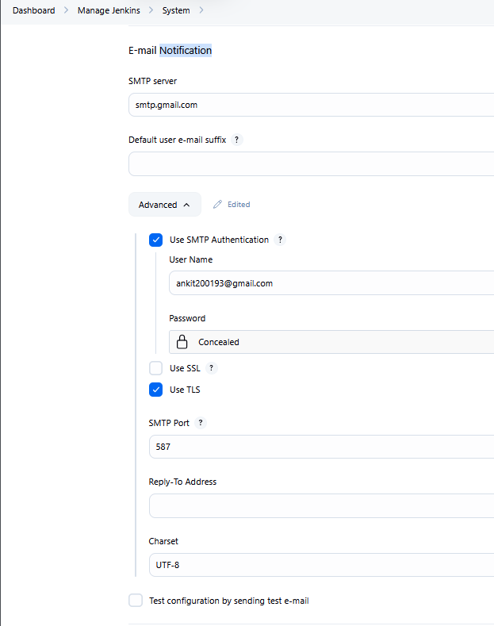
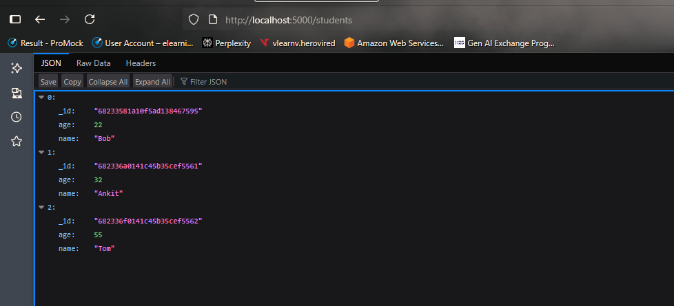
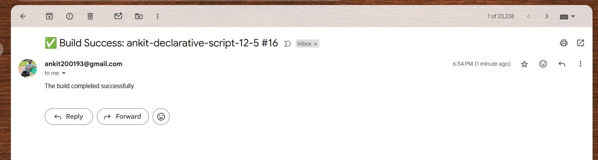

# Student App CI/CD with Jenkins

This project demonstrates a complete CI/CD pipeline for a Python Flask application using **Jenkins**. The application connects to **MongoDB** and is deployed in multiple stages, including build, test, and deployment.

---

## Technologies Used

* Python 3
* Flask
* MongoDB (via URI)
* Jenkins
* Pytest

---

##  Project Structure

```
├── app.py                 # Main Flask app
├── requirements.txt       # Python dependencies
├── tests/                 # Optional: Unit test directory
├── flask.log              # Flask logs (created during pipeline)
└── Jenkinsfile            # CI/CD Pipeline
```

---

##  Jenkins CI/CD Pipeline Overview

###  **1. Checkout**

* Clones the `main` branch from GitHub.

###  **2. Build**

* Creates a virtual environment.
* Installs all Python dependencies listed in `requirements.txt`.

###  **3. Test**

* Activates the virtual environment.
* Exports the `MONGO_URI` from Jenkins credentials.
* Runs `pytest` tests. If no tests are found, the step is skipped.

###  **4. Run Flask App (Smoke Check)**

* Starts the Flask server in the background using `nohup`.
* Waits for 5 seconds.
* Sends an HTTP request to verify the server is running.
* Terminates the Flask server.

###  **5. Deploy to Staging**

* Runs only if the previous stages are successful.
* Placeholder for staging deployment steps.

---

## Secrets Management

* MongoDB URI is securely managed using Jenkins Credentials.
* The environment variable `MONGO_URI` is injected automatically.

---

##  Notifications

* On **success**, a notification email is sent to `ankit200193@gmail.com`.
* On **failure**, a detailed failure notification is sent.

---

##  Prerequisites

* Jenkins server with Python 3 installed
* MongoDB URI stored as `ANKIT_MONGO_URI` in Jenkins credentials
* GitHub access to clone the repository

### Setting the Gmail notification:



### To create the password:

* Go to your Google Account: https://myaccount.google.com/

* Enable 2-Step Verification.

* After enabling, go to Security > App Passwords.

* Choose App: Mail and Device: Other (Jenkins).

* Click Generate — you’ll get a 16-character app password.

### MongoDB Setup


Create a database and collection in MongoDB

Create MONGO_URI variable in the  ** Manage Jenkins > Security > Credential > global **

Ensure to sync the variable name with the ```app.py```

### Git Webhook Setup:

| Field            | Value                                                                    |
| ---------------- | ------------------------------------------------------------------------ |
| **Payload URL**  | `http://<your-jenkins-url>/github-webhook/`                              |
| **Content type** | `application/json`                                                       |
| **Secret**       | *(optional)* Add a secret if you want to secure communication            |
| **Events**       | Choose “**Just the push event**” (or also enable Pull request if needed) |

You can test the setup by hitting on recent deliveries. 

Note : **<your-jenkins-url>** it should not include your pipeline name. **github-webhook** is constant component.

---

## Results 


### Jenkins build


### App results



### Email notification



